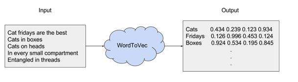
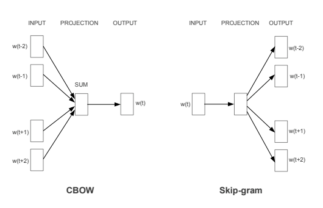

# How the twitterverse reacts to the Mens' World Championship vs the Womens' World Championship...

## Outils :

#### Word2vec :
- Méthode introduite par Thomas Mikolov, chercheur chez Google

- Research Paper “Efficient Estimation of Word Representations in Vector Space”, 2013

- Structure de réseau de neurones pour générer du word embedding en entraînant un model sur une problématique d’apprentissage supervisé pour une  classification.

- Réseau de neurone à deux couches
- Input : un corpus de texte, output : un set de vecteurs
- N’est pas du deep learning
- Objectif : Un set bien entraîné de vecteurs de mots va placer des mots similaires dans un même endroit de façon proche.

Elvis Costello “Writing about music is like dancing about architecture.”

*A est à B ce que C est à  ?*

*vector(king)	–	vector(man)	 +	vector(woman)	 =	 vector(queen)*

CBOW & Skip-gram:

[Exemple de code ici :)](https://github.com/kavgan/nlp-in-practice/blob/master/word2vec/Word2Vec.ipynb)